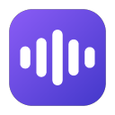
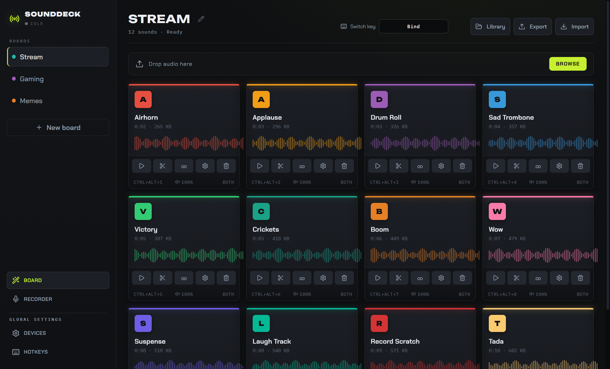

<div align="center">



# SoundDeck Studio

**Free, open-source desktop soundboard for Windows and macOS with global hotkeys, virtual mic routing, and Corsair G-key support.**

[](https://github.com/MaksimPeterburgskiy/sounddeck-studio/releases/latest)
[](https://github.com/MaksimPeterburgskiy/sounddeck-studio/actions/workflows/ci.yml)
[](https://github.com/MaksimPeterburgskiy/sounddeck-studio/releases/latest)
[](LICENSE)

Build boards from local audio files, trigger sounds with global hotkeys, and send the mix to Discord, OBS, or games through a virtual microphone.



</div>

---

## Download

**[Download the latest release](https://github.com/MaksimPeterburgskiy/sounddeck-studio/releases/latest)** and choose the installer for your platform.

- **Windows:** download `SoundDeck-Studio-Setup-x.y.z.exe`. The installer sets up the [VB-CABLE](https://vb-audio.com/Cable/) virtual audio driver if you do not already have it. A portable `.exe` is also available, but portable builds do not auto-update.
- **macOS:** download `SoundDeck.Studio-x.y.z.pkg`. The package is signed and notarized, installs SoundDeck Studio into `/Applications`, and includes the BlackHole 2ch audio driver for virtual microphone routing.

Installed builds check for updates and apply them on restart.

> **Windows SmartScreen:** builds are currently unsigned, so the first install may show a SmartScreen warning. Click **More info -> Run anyway**.

> **macOS permissions:** microphone passthrough, recording, and global hotkeys may require approving SoundDeck Studio in **System Settings -> Privacy & Security**.

### Beta builds

A new beta is published every night whenever `main` has changed, as a prerelease on the [releases page](https://github.com/MaksimPeterburgskiy/sounddeck-studio/releases) (versions like `0.1.18-beta.42`). Betas are built, signed, and notarized exactly like stable releases and install over the stable app in place.

- A beta install auto-updates to newer betas and moves back onto the next stable release once one is newer.
- A stable install never sees betas unless you opt in.
- You can switch channels any time in **Settings -> Update Channel** inside the app.

> **Switching back to stable** may downgrade the app to the current stable version, and boards or settings saved by a newer beta may not load cleanly in an older build.

## Features

### Soundboard
- Unlimited boards and sound pads, each with its own title, color, icon, volume, and hotkey
- Drag-and-drop import of `.wav`, `.mp3`, `.ogg`, `.flac`, `.m4a`, `.aac`, and `.webm`
- Sounds are copied into the app library, so they keep working if you move the originals
- Loop, fade in/out, play/stop toggle, and retrigger modes (restart, overlap, stop)
- Multiple sounds at once, with decoded audio caching for quick retriggers
- Waveform previews and a clip editor with trim support

### Virtual microphone and routing
- Route the soundboard into a virtual mic that Discord, OBS, and games see as a real input device
- Mix your physical microphone into the virtual mic (passthrough)
- Independent volume controls for mic, soundboard, and headphone monitoring
- Choose the output device for each audio bus

### Hotkeys
- Global OS-level hotkeys that work while you're in-game
- Corsair G-key support (`G1`-`G20`) via the iCUE SDK
- Per-board switch hotkeys and a stop-all hotkey (default `Ctrl+Alt+Space`)
- Inline hotkey capture: click a pad and press the combo

### Workflow
- Minimize to the system tray; relaunching focuses the open window
- Built-in recorder: capture a mic clip, trim it, and drop it on the active board
- Export/import boards as `.sdboard` files with embedded audio to share boards with friends

## Quick start: virtual mic in Discord/OBS

1. Install SoundDeck Studio. Windows installs VB-CABLE if needed; macOS installs the bundled BlackHole 2ch driver.
2. Open **Devices** and set **Virtual cable playback device** to `CABLE Input` on Windows or `BlackHole 2ch` on macOS.
3. Enable **Microphone to virtual mic** to send your voice, **Soundboard to virtual mic** to send sounds, or both to mix them.
4. In Discord/OBS/your game, set the input device to `CABLE Output` on Windows or `BlackHole 2ch` on macOS.
5. Keep **Monitor soundboard** pointed at your real headphones so you hear what you play.

## Development

Requirements:

- Windows 10/11 or macOS
- Node.js 22.12+
- pnpm 11.6+ via Corepack

```bash
git clone https://github.com/MaksimPeterburgskiy/sounddeck-studio.git
cd sounddeck-studio
corepack enable
pnpm install
pnpm start          # dev server + Electron with hot reload
```

| Command | What it does |
| --- | --- |
| `pnpm start` | Fetch verified native tools, then run the app in development (Vite + Electron) |
| `pnpm test` | Run the Vitest unit tests |
| `pnpm run build` | Type-check with `tsc` and bundle the renderer |
| `pnpm run dist:win` | Build the Windows installer + portable exe into `release/` |
| `pnpm run dist:mac` | Build the signed/notarized macOS package and updater artifacts into `release/` |
| `pnpm run dist:mac:unsigned` | Build an unsigned macOS smoke-test app artifact |

Tech stack: Electron, React 19, TypeScript, Vite, Web Audio API, and electron-builder.

```
electron/   Main process (window, tray, global hotkeys, library storage, Corsair, auto-update)
src/        Renderer (React + TypeScript)
src/lib/    Pure logic (board model, audio engine, hotkey parsing, waveforms)
build/      Packaging resources (icons, NSIS script, generated macOS package inputs)
scripts/    Build helpers (VB-CABLE download, BlackHole build/package steps, release utilities)
```

## Contributing

Please read [CONTRIBUTING.md](CONTRIBUTING.md) before opening a pull request. Open an issue before large changes, target the `main` branch, keep PRs focused, and make sure `pnpm run build` and `pnpm test` pass.

Releases are cut from the `prod` branch by maintainers via the [Release workflow](.github/workflows/release.yml).

## License

[GNU GPL v3](LICENSE) © Maksim Peterburgskiy
